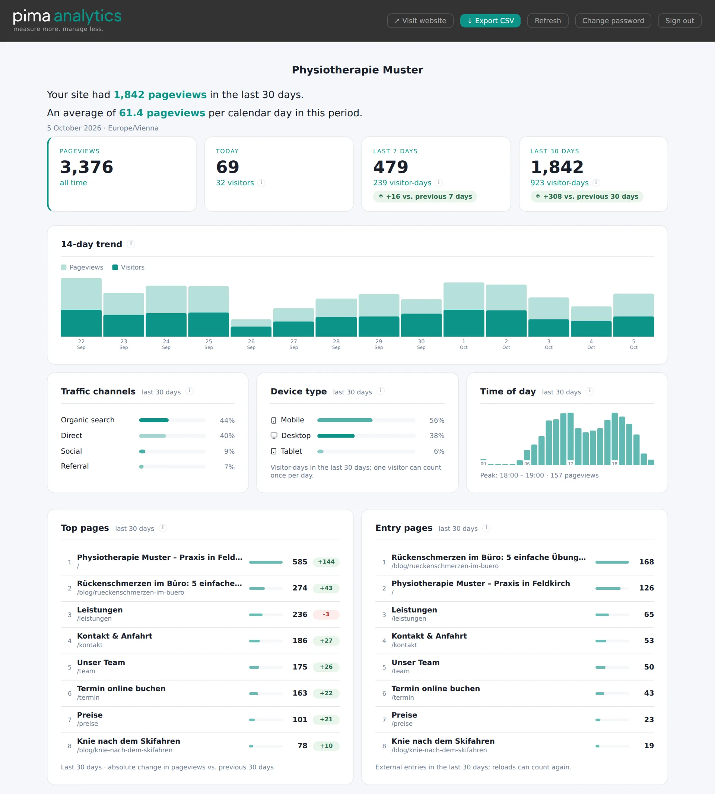
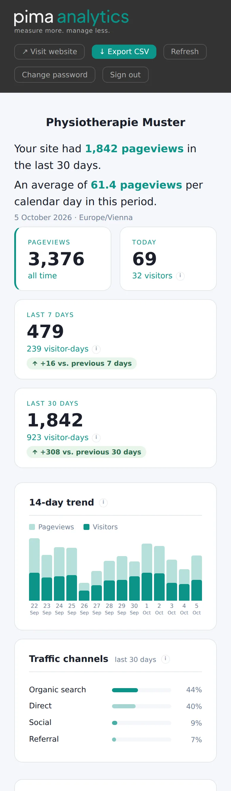

<p align="center">
  <picture>
    <source media="(prefers-color-scheme: dark)" srcset="assets/pima_dark_logo.svg">
    
  </picture>
</p>

> *Pima* (Swahili) — to measure, to assess.
> **pima Analytics** does exactly that: it measures your website traffic. No analytics cloud. No complexity. Your analytics rows stay on your hosting.

**Cookie-free visitor tracking and privacy-friendly website analytics for PHP shared hosting.**

No Node.js. No Docker. No external database. No tracking cookies.
Just upload four files, add a few lines to your existing `.htaccess` and `robots.txt`, paste one snippet — done.

Designed for beginners — if you can upload files via FTP and edit a text file, you can run pima Analytics. Works on any website: static HTML, WordPress, or any PHP-based site.

---

## Why pima Analytics?

| | pima Analytics | Matomo | Plausible | Google Analytics |
|---|---|---|---|---|
| No tracking cookies | ✅ | ⚠️ | ✅ | ❌ |
| No external database | ✅ | ❌ MySQL | ❌ PostgreSQL + ClickHouse | ❌ |
| Shared hosting | ✅ | ⚠️ | ❌ requires Docker | ✅ |
| Self-hosted | ✅ | ✅ | ✅ | ❌ |
| Install time | ~5 min | 30+ min | 1–2h | 5 min |

---

## What's in this repository

Only the four files you actually need:

```
pima.php             ← Dashboard (served at /pima and /analytics)
pima-tracker.php     ← Tracking pixel endpoint
pima-core.php        ← Configuration (passwords, branding, timezone)
pima-cache/
└── .htaccess        ← Blocks direct access to the SQLite database
```

No `.htaccess` in the project root, no `robots.txt`. You almost certainly already have both — the instructions below show exactly which lines to add to your existing files.

The repository also includes [`pima-agent.md`](pima-agent.md) — an optional install guide for AI coding agents (see [Installation](#installation)).

> **Downloaded the whole repository?** Only `pima.php`, `pima-tracker.php`, `pima-core.php` and `pima-cache/` need to go on your server. Everything else — `README.md`, `LICENSE`, `pima-agent.md`, `.gitignore` and the `assets/` folder — is just for GitHub and can be deleted from your web root. The dashboard logos are embedded directly in `pima.php`, so `assets/` is not needed at runtime.

---

## Installation

> **Using an AI coding agent?** If you work with an AI agent that can edit your project (Claude Code, Cursor, Copilot, …), you don't have to follow the steps manually. Copy the pima files into your project, then prompt:
>
> > Read `pima-agent.md` and install pima into this site.
>
> The agent configures `pima-core.php`, inserts the tracking snippet into your footer, and updates your `.htaccess` and `robots.txt` for you — following the included [`pima-agent.md`](pima-agent.md) guide. Prefer to do it yourself? Just follow the manual steps below.

### Step 1 — Upload the files

Upload all four files to your web root via FTP, keeping the structure intact:

```
your-webroot/
├── pima.php
├── pima-tracker.php
├── pima-core.php
└── pima-cache/
    └── .htaccess
```

Make sure `pima-cache/` is writable by PHP (permissions `0750` on most shared hosts). The SQLite database is created automatically on the first page view.

### Step 2 — Set your passwords, timezone and language

Open `pima-core.php` and edit these lines:

```php
// --- Auth ---
define('STATS_PASSWORD', 'your-dashboard-password');

// --- Tracker token ---
define('TRACKER_TOKEN', 'my-secret-word');

// --- Timezone ---
define('TIMEZONE', 'Europe/Vienna'); // full list: php.net/timezones

// --- Language ---
define('LANG', 'en'); // 'en' = English (default), 'de' = Deutsch
```

> **Why two values?**
> The **tracker token** appears in every tracked page's HTML source — anyone can see it. It only allows *writing* hits, not reading your dashboard. The **dashboard password** is used only by the protected server-side configuration and login.
>
> **Important:** Use a different value for the tracker token than any of your existing passwords — since it's visible in your source code, treat it as a public identifier, not a secret.

`STATS_PASSWORD` also accepts a value generated by PHP's `password_hash()`.
Using a hash is preferred for production; a plaintext value remains supported
for simple shared-hosting installations. In either case, web access to
`pima-core.php` must be denied. The shipped value `change-me-please` (and an
empty value) locks sign-in until you set your own.

**Your client can change the password themselves** under *Change password* in
the dashboard header. The new password is stored as a hash in
`pima-cache/.pima-password` and takes precedence over `STATS_PASSWORD`; every
other device is signed out. That file is also your reset: if the password is
forgotten, delete `pima-cache/.pima-password` via FTP and `STATS_PASSWORD`
applies again. Set `STATS_PASSWORD_CHANGE` to `false` to hide the form; an
existing `.pima-password` still applies until you delete it.

### Step 3 — Add the pima rules to your existing `.htaccess`

Your project root almost certainly already has a `.htaccess`. Open it and append this block at the end:

```apache
# pima Analytics
RewriteEngine On
RewriteRule ^pima$       pima.php [L]
RewriteRule ^analytics$  pima.php [L]
<Files "pima-core.php">
    Require all denied
</Files>
Options -Indexes
```

What each line does:

| Line | Purpose | Safe to skip if… |
|---|---|---|
| `RewriteEngine On` | Enables the rewrite rules below | …it already appears earlier in your file |
| `RewriteRule ^pima$ pima.php [L]` | Maps `/pima` → `pima.php` | Never — required for the dashboard URL |
| `RewriteRule ^analytics$ pima.php [L]` | Maps `/analytics` → `pima.php` | Never — required for the alternate URL |
| `<Files "pima-core.php">…</Files>` | Blocks web access to your password and token | Only if the same file is already denied elsewhere |
| `Options -Indexes` | Disables directory listings | …it already appears earlier |

> **Older Apache (2.2)?** Replace `Require all denied` with:
> ```apache
> Order Allow,Deny
> Deny from all
> ```

> **No `.htaccess` at all?** Create one in your web root with exactly the block above.

> **Nginx?** `.htaccess` is ignored. Add equivalent server rules and test them:
> ```nginx
> location = /pima-core.php { deny all; }
> location ^~ /pima-cache/ { deny all; }
> location = /pima { try_files $uri /pima.php?$query_string; }
> location = /analytics { try_files $uri /pima.php?$query_string; }
> ```
> If your hosting layout allows it, placing `DB_PATH` outside the public web
> root provides an additional layer of protection.

### Step 4 — Add four lines to your existing `robots.txt`

Your project root almost certainly already has a `robots.txt`. Open it and — inside the `User-agent: *` section — append:

```
Disallow: /pima
Disallow: /analytics
Disallow: /pima-tracker.php
Disallow: /pima-cache/
```

> **No `robots.txt` at all?** Create one in your web root with:
> ```
> User-agent: *
> Disallow: /pima
> Disallow: /analytics
> Disallow: /pima-tracker.php
> Disallow: /pima-cache/
> ```

`robots.txt` only asks compliant crawlers not to index these paths. It is not
access control; the Apache or Nginx rules in Step 3 provide the actual protection.

### Step 5 — Add the tracking snippet

Replace `my-secret-word` with the value you set for `TRACKER_TOKEN` in Step 2.

**Static HTML sites**

Paste this snippet directly before the closing `</body>` tag of every page you want to track — or better, into your shared footer file (`footer.php`, `partials/footer.php`, `includes/footer.html`, …) so it appears on every page automatically.

```html
<script>
fetch('/pima-tracker.php?p=' + encodeURIComponent(location.pathname)
  + '&title=' + encodeURIComponent(document.title)
  + '&r=' + encodeURIComponent(document.referrer)
  + '&t=my-secret-word');
</script>
```

**WordPress**

Add this to your **child theme's** `functions.php` or a small site-specific
plugin. Do not edit a parent theme directly: a theme update can overwrite the
change.

```php
function pima_tracker() { ?>
<script>
fetch('/pima-tracker.php?p=' + encodeURIComponent(location.pathname)
  + '&title=' + encodeURIComponent(document.title)
  + '&r=' + encodeURIComponent(document.referrer)
  + '&t=my-secret-word');
</script>
<?php }
add_action('wp_footer', 'pima_tracker');
```

This runs automatically on every page — no need to touch individual posts or templates.

> **Critical:** Never insert the snippet twice on the same rendered page (e.g. once in a shared footer *and* again on an individual page). Every hit would be double-counted.

### Done.

Open `yourdomain.com/pima` or `yourdomain.com/analytics` in your browser, enter your dashboard password, and watch your traffic come in.

### Step 6 — Make it yours (optional)

Open `pima-core.php` and adapt the dashboard to match your site:

```php
// --- Branding ---
define('BRAND_COLOR', '#0d9488'); // any hex color, e.g. '#c0392b' for red
define('BRAND_LOGO',  '');        // same-origin path or URL to your logo
define('BRAND_NAME',  'My Website'); // change this to your site name
```

**Adding your logo:**

```php
// Option A — file on your server (recommended)
define('BRAND_LOGO', '/assets/logo.svg');

// Option B — full URL on the same site
define('BRAND_LOGO', 'https://yourdomain.com/assets/logo.png');
```

Supported formats: SVG, PNG, JPG, WebP. For security, the dashboard's Content
Security Policy blocks images hosted on other domains. The logo appears centered
above the summary sentence. Leave empty to show `BRAND_NAME` as text instead.

---

## Language

pima Analytics ships in English and German. English is the default; for a German dashboard change one line in `pima-core.php`:

```php
define('LANG', 'de'); // 'en' = English (default), 'de' = Deutsch
```

Shipped German uses formal address (*Sie*), like every product of the family.

**Adding your own language** takes about 5 minutes — open `pima.php`, find the `$strings` array, copy the `'en'` block, give it a new key (e.g. `'fr'`), translate the strings, and set `LANG` to `'fr'` in your config. All dashboard labels, tooltips, and messages will follow.

**Rewording single strings** — tone, form of address, your own support contact — does not need a fork. Override individual keys from `pima-core.php`; unknown keys are ignored, so a typo cannot blank out a label:

```php
$PIMA_STRINGS = [
    'login_help' => 'Forgot your password? Call us: +43 123 456789',
    'no_data'    => 'No visits yet — they will show up here within minutes.',
];
```

---

## Security

pima Analytics stays small while providing the protections expected from a
self-hosted dashboard on shared hosting.

**What is protected after completing the installation steps:**
- `pima-core.php` is blocked from web access via `.htaccess` — no one can read your password from the browser
- `pima-cache/` is fully blocked — the SQLite database cannot be downloaded directly
- The login form has **brute-force protection**: after 5 failed attempts, the form locks out for 15 minutes (configurable in `pima-core.php`)
- Concurrent login attempts share one atomic counter; expired lockouts reset cleanly
- Dashboard sessions use their own cookie (`pima_session`), so other PHP apps on the same domain cannot sign users out; they use strict cookie mode, regenerate after login and expire after inactivity (30 minutes), after a maximum lifetime (12 hours) or when the password changes
- The shipped default password and an empty password lock sign-in instead of only warning
- Changing the password in the dashboard requires the current one, counts wrong attempts towards the same lockout as the login and signs out every other session. The new password is stored only as a `password_hash()` in `pima-cache/.pima-password` (mode 0600, blocked with the rest of `pima-cache/`)
- All inputs to `pima-tracker.php` are safely bound using SQLite3 prepared statements to prevent SQL injection
- CSV fields are neutralised before export to prevent spreadsheet formula execution
- Tracker requests are rate-limited per keyed IP bucket
- The **tracker token** (`TRACKER_TOKEN`) blocks unauthenticated drive-by noise. It is public in your page source and is not a defence against deliberate fake hits

**Important:** pima Analytics should only be used on sites with HTTPS. The login password is sent via POST — over plain HTTP it would be visible in transit. Most shared hosts provide free SSL — make sure it's active.

**Configuring lockout settings:**
```php
define('MAX_LOGIN_ATTEMPTS', 5);    // Failed attempts before lockout
define('LOCKOUT_SECONDS',    900);  // Lockout duration (900 = 15 minutes)
```

---

## Dashboard

<p align="center">
  
</p>

From top to bottom:

- **Summary** — Pageviews over the last 30 days and the daily average
- **KPIs** — Total pageviews and today, plus rolling 7- and 30-day totals with an
  absolute delta against the preceding window of the same length
- **14-day trend** — Daily pageviews and estimated visitors as a bar chart
- **Traffic channels** — Direct, search, social and referral entries; internal navigation is excluded
- **Device type** — Desktop / Mobile / Tablet by visitor-day
- **Time of day** — Pageviews by hour in the configured `TIMEZONE`
- **Top pages** — Ranked by page title, with the change against the previous 30 days
- **Entry pages** — Pages opened with an external referrer
- **Referrers** — External hosts that generated entries
- **Countries** — Detected countries by visitor-day
- **Browser language** — Language distribution by visitor-day
- **Latest pageviews** — The last 50 pageviews (collapsed by default)
- **CSV export** — Download all your data anytime
- **Change password** — Users change their own password; see Step 2

All windowed panels roll rather than following the calendar: "last 30 days"
always means the 30 days up to and including today. A calendar month would
drop every one of these panels to near zero at midnight on the 1st, which on a
low-traffic site makes the first week of each month unreadable — and it would
make the deltas compare windows of different lengths.

The dashboard works on phones as well:

<p align="center">
  
</p>

### Error codes

`T…` means the server or the install needs attention. The codes match pesi CMS, so the same number means the same thing across the family.

| Code | What happened | What to do |
|---|---|---|
| `T8` | No password of your own is set — `STATS_PASSWORD` is empty, missing or still the shipped default. Sign-in stays locked | Set a real `STATS_PASSWORD`, ideally a `password_hash()` value |
| `T15` | The login lockout file in `pima-cache/` could not be opened or written. pima then refuses every sign-in, because without it the brute-force lockout would not hold. The reason is also written to the PHP error log | Give the web server write access to `pima-cache/` and check owner and permissions of the `.lockout_*.json` files |
| `T20` | The dashboard could not save a new password, or `pima-cache/.pima-password` exists but holds no valid hash. A failed change keeps the previous password; a damaged file locks sign-in instead of silently falling back to `pima-core.php` | Check write access to `pima-cache/`. Delete a damaged `.pima-password` via FTP; `STATS_PASSWORD` then applies |

---

## What pima writes to disk

Everything goes into `pima-cache/`, which the shipped `.htaccess` blocks completely.

| File | Created | Purpose |
|---|---|---|
| `analytics.db` | on the first tracked pageview | The SQLite database with one row per pageview (see [What gets tracked](#what-gets-tracked)) |
| `.salt_<date>` | once per day | Random salt for the daily visitor hash; deleted after two days |
| `.runtime_secret` | on the first tracked pageview | Random key for the digests below |
| `.rate_*.json` | per tracker request | Tracker rate limit per keyed IP bucket |
| `.geo_cache.json` | with `GEO_ENABLED` | Country per keyed digest of the truncated IP, so the lookup service is asked at most once per network |
| `.last_prune` | once per day | When rows older than `DATA_RETENTION_DAYS` were last removed |
| `.lockout_*.json` | on the first sign-in attempt | Login lockout per IP digest: failed attempts and lock time |
| `.pima-password` | when a user changes the password | `password_hash()` of the dashboard password; takes precedence over `STATS_PASSWORD`. Delete it to reset to `pima-core.php` |
| `sess_*` | on every dashboard visit | PHP session files of the dashboard |

---

## What gets tracked

| Field | Example | Notes |
|---|---|---|
| Date | `2026-04-15` | Server date |
| Time | `14:32:01` | Server time |
| Page | `/blog/hello-world` | URL path |
| Title | `Hello World — My Blog` | Human-readable page title |
| Referrer | `google.com` | External hostname only; internal navigation is blank |
| Entry | `1` | Distinguishes direct/external entries from internal navigation |
| Device | `desktop` / `mobile` / `tablet` | Derived from User-Agent; the User-Agent itself is not stored |
| Country | `AT` | Optional HTTPS lookup of the truncated IP; no IP is stored |
| Language | `de` | Primary language from `Accept-Language` header |

**Never stored:** raw IP address, tracking cookies, user identity or full User-Agent.

---

## Configuration reference

All settings in `pima-core.php`:

```php
define('STATS_PASSWORD',     'change-me-please');                    // Dashboard password or password_hash() value; the shipped value locks sign-in
define('STATS_PASSWORD_CHANGE',true);                                // Users may change it in the dashboard (pima-cache/.pima-password)
define('TRACKER_TOKEN',      'my-secret-word');                      // Public identifier used by the tracking snippet
define('TIMEZONE',           'Europe/Vienna');                       // php.net/timezones
define('LANG',               'en');                                  // 'en' (default) or 'de'

define('BRAND_COLOR',        '#0d9488');                             // Any CSS hex color
define('BRAND_NAME',         'My Website');                               // Shown on the login screen, in the dashboard and the browser tab
define('BRAND_LOGO',         '');                                    // Path to self-hosted logo image
define('DB_PATH',            __DIR__.'/pima-cache/analytics.db');    // SQLite database location
define('GEO_ENABLED',        true);                                  // HTTPS country lookup of the truncated IP via IPWhois.io
define('DATA_RETENTION_DAYS',365);                                   // 0 keeps rows forever
define('EXCLUDED_IPS',       []);                                    // Your own IPs to ignore
define('TRUST_PROXY',        false);                                 // Enable only behind a trusted CDN/proxy
define('TRUSTED_PROXY_IPS',  []);                                    // Exact proxy addresses allowed to send forwarded headers
define('MAX_LOGIN_ATTEMPTS', 5);                                     // Failed attempts before lockout
define('LOCKOUT_SECONDS',    900);                                   // Lockout duration (900 = 15 min)
define('SESSION_IDLE_SECONDS',1800);                                 // Dashboard idle timeout
define('SESSION_MAX_SECONDS', 43200);                                // Sign in again after 12 hours at the latest
define('TRACKER_RATE_LIMIT', 120);                                   // Hits per IP bucket/window
define('TRACKER_RATE_WINDOW',60);                                    // Rate window in seconds
define('RECENT_ENTRIES',     50);                                    // Entries in the latest-pageviews list
define('TREND_DAYS',         14);                                    // Days shown in trend chart
define('ADVANCED_MODE',      false);                                 // Enable danger zone in dashboard

// Optional: override single dashboard strings — see Language
$PIMA_STRINGS = ['no_data' => 'No visits yet.'];
```

---

## Privacy & GDPR

- No tracking cookies; whether consent is required still depends on your jurisdiction and implementation
- With Geo enabled, only a truncated IP is sent to IPWhois.io over HTTPS for country lookup: IPv4 with the last octet zeroed (`203.0.113.57` → `203.0.113.0`), IPv6 cut to its first 64 bits. The full visitor IP never leaves your server
- Geo cache and tracker rate-limit keys are keyed digests; raw IPs are **never written to disk**
- Only the country code (e.g. `AT`) is stored, not the IP
- Analytics rows are deleted after `DATA_RETENTION_DAYS` (365 by default)
- For zero external requests: set `GEO_ENABLED = false`
- Your privacy notice should name IPWhois.io when Geo lookup is enabled

---

## Advanced Mode

For power users who want extra control. Disabled by default — won't appear for regular users.

Enable it in `pima-core.php`:

```php
define('ADVANCED_MODE', true);
```

This adds a **Danger Zone** section at the bottom of the dashboard with:
- Database info (file size, row count)
- **Clear all data** — permanently deletes all analytics rows (requires confirmation)

Disable again by setting it back to `false`.

---

## Updating

An update replaces exactly two files: **`pima.php` and `pima-tracker.php`**. Upload both from the same release. `pima-core.php` (your settings, your `$PIMA_STRINGS`) and `pima-cache/` (your data) are never part of an update, and the tracking snippet stays as it is.

Settings added in a later release take their default automatically, so an update never requires editing `pima-core.php`. The version you run is shown in the dashboard footer.

### To 0.5 (from any earlier copy)

0.5 is the first numbered release. When you update an existing install:

- **Everyone signs in once more.** The dashboard now uses its own session cookie, so it no longer signs people out of other PHP apps on the same domain, and vice versa.
- **The shipped password locks sign-in.** If `STATS_PASSWORD` is still `change-me-please` (or empty), set your own before uploading, otherwise the login screen shows `T8`.
- **Users can change the password** in the dashboard. Set `STATS_PASSWORD_CHANGE` to `false` in `pima-core.php` if only you should set it.
- **Sessions end after 12 hours** at the latest (`SESSION_MAX_SECONDS`).
- **German now uses formal address** (*Sie*). Put any wording you prefer into `$PIMA_STRINGS`.

---

## Troubleshooting

### "No data yet" — dashboard stays empty

The most common reason: the tracking snippet is missing or the token is wrong.

1. Open your page in the browser, right-click → View Page Source, and search for `pima-tracker.php` — if it's not there, the snippet wasn't added correctly
2. Make sure the token in your snippet matches `TRACKER_TOKEN` in `pima-core.php` exactly — it's case-sensitive
3. Check that the `pima-cache/` folder exists on your server. If it's missing, create it manually via FTP and set permissions to `0750`
4. To test the tracker directly, open `yourdomain.com/pima-tracker.php?p=/test&t=YOUR_TOKEN` in your browser — you should see a blank white page (1×1 pixel), not an error

### Login doesn't work

Open `pima-core.php` and check `STATS_PASSWORD` — watch out for extra spaces or special characters that your text editor may have added. The password is case-sensitive.

If the password was changed in the dashboard, it lives in `pima-cache/.pima-password` and `STATS_PASSWORD` no longer applies. Delete that file via FTP to reset to `STATS_PASSWORD`. The same applies when the login screen reports that the password file is damaged.

If the login screen says sign-in is locked because no password of your own is set, `STATS_PASSWORD` is empty or still `change-me-please`.

If you're locked out after too many attempts, wait 15 minutes or increase `MAX_LOGIN_ATTEMPTS` temporarily.

### Dashboard is completely blank

This is usually a PHP syntax error in `pima-core.php`. Check that your password doesn't contain special characters like `$` or `'` — if it does, choose a simpler password with only letters and numbers.

### Country detection not working

Your host may have `allow_url_fopen` disabled, or IPWhois.io may be unavailable or rate-limited. Set `GEO_ENABLED = false` in `pima-core.php` to disable country lookup — everything else will continue to work normally.

### `/pima` or `/analytics` returns a 404

`mod_rewrite` may be disabled on your server, or `.htaccess` files may not be allowed. Contact your host and ask them to enable `mod_rewrite` and `AllowOverride All`.

### Your own visits are showing up in the stats

Add your IP address to `EXCLUDED_IPS` in `pima-core.php`:
```php
define('EXCLUDED_IPS', ['your.ip.address']);
```
You can find your current IP at [whatismyip.com](https://www.whatismyip.com).

### Something looks wrong and you're not sure why

Check your PHP error log and verify that `pima-cache/` is writable. Before
changing anything in that folder, download `analytics.db` as a backup.

Do **not** delete `analytics.db` as a troubleshooting step: it contains all
analytics rows. Deleting it, or using **Clear all data** in Advanced Mode,
permanently erases the statistics. Transient `.geo_cache.json`, `.rate_*.json`
and `.lockout_*.json` files can be removed if you specifically need to reset
Geo caching or request/login limits; pima recreates them automatically.

---

## Honest limitations

- **Estimated daily visitors only** — pima Analytics derives a daily anonymous identifier from a coarsened IP, the User-Agent and a rotating salt. Shared networks can merge visitors and browser changes can split them, so this is an estimate rather than a person count. The identifier cannot be correlated across days; 7- and 30-day figures are therefore explicitly labelled visitor-days. An all-time visitor count is deliberately not shown.
- **Entry-based acquisition** — traffic channels classify page entries, not people. Internal navigation is excluded. Browser reloads can create another entry.
- **Legacy channel data** — after upgrading, old external referrers remain usable. Old empty referrers cannot be distinguished from internal navigation and are therefore excluded instead of being guessed as direct traffic.
- **Not for high-traffic sites** — SQLite handles millions of rows comfortably, but concurrent write spikes (500+ simultaneous visitors) may cause brief delays.
- **No real-time view** — dashboard reflects data as written to the database.

---

## Requirements

- PHP 7.4+
- Apache with `.htaccess` support, or equivalent Nginx deny rules
- SQLite3 and mbstring extensions enabled
- `allow_url_fopen` with HTTPS support (only for country detection)
- HTTPS (strongly recommended)

---

## License

MIT — free to use, modify, and self-host.

---

*pima Analytics — measure more. manage less.*

---

## Support

pima Analytics is free and open-source. If it saves you time, consider buying me a coffee. ☕

<a href="https://ko-fi.com/ludescherstudio" target="_blank"></a>
